# 3-D EKF Estimation for Quadrotor #

This project develops an Extended Kalman Filter (EKF) for use as an estimator in a custom vehicle controller. The project is done in C++ and is best implemented on MacOS with Xcode.

The primary code is as follows:
- `QuadEstimatorEKF.cpp`
- `config/QuadEstimatorEKF.txt`
- `QuadController.cpp`
- `config/QuadControlParams.txt`

<p>&nbsp;</p>

## Development Environment Setup ##

### In OS X ###

For Mac OS X, the recommended IDE is XCode.

1. Open the project from the `<simulator>/project` directory.
2. After opening project, you need to set the working directory:
  1. Go to *(Project Name)* | *Edit Scheme*
  2. In new window, under *Run/Debug* on left side, under the *Options* tab, set Working Directory to `$PROJECT_DIR` and check ‘use custom working directory’.
  3. Compile and run the project. You should see a single quadcopter.

<p>&nbsp;</p>

### The Code ###

- `src/QuadEstimatorEKF.cpp`: This file contains the implementation of the EKF.
- `src/QuadControl.cpp`:  This file contains all of the code for the custom PID controller.

All the configuration files for the controller and the vehicle are in the `config` directory.  All control gains and other desired tuning parameters are in config files named `QuadControlParams.txt` and `QuadEstimatorEKF.txt`.  

<p>&nbsp;</p>

### The Simulator ###

In the simulator window itself, you can right click the window to select between a set of different scenarios that are designed to test the different parts of the controller.

Vehicles are created and graphs are reset whenever a scenario is loaded. When a scenario is reset (due to an end condition such as time or user pressing the ‘R’ key), the config files are all re-read and state of the simulation/vehicles/graphs is reset -- however the number/name of vehicles and displayed graphs are left untouched.

When the simulation is running, you can use the arrow keys on your keyboard to impact forces on the drone to see how the controller reacts to outside forces being applied.

#### Keyboard / Mouse Controls ####

keyboard / mouse commands

 - Left drag - rotate
 - X + left drag - pan
 - Z + left drag - zoom
 - arrow keys - apply external force
 - C - clear all graphs
 - R - reset simulation
 - Space - pause simulation

<p>&nbsp;</p>

## Estimator Design ##

The following steps detail the development and construction of the EKF.

### 1. Sensor Noise Evaluation ###

To characterize the noise in the GPS position and the accelerometer, vehicle data was taken on a stationary vehicle. After analysis and calculation of the standard deviation, the following parameters were set in the test unit `config/6_Sensornoise.txt`:

```bash
MeasuredStdDev_GPSPosXY = 0.72
MeasuredStdDev_AccelXY = 0.51
```

The results of the simulation are shown below. The calculated standard deviations is shown on the graphs and captures the data appropriately.

<p align="center">
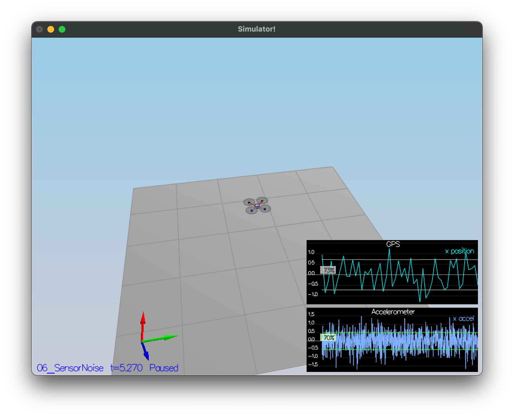
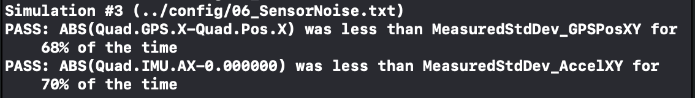
</p>

<p>&nbsp;</p>

### 2. Attitude Estimation ###

The next step is to improve rate gyro attitude integration scheme with a complimentary filter. This is implemented in `QuadEstimatorEKF.cpp` in the function `UpdateFromIMU()`. This was accomplished by using the current attitude estimate (rollEst, pitchEst and ekfState(6)) to integrate the body rates into new Euler angles.

To do this, I implemented the following rotation matrix which produced the results shown below.

<p align="center">
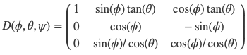
</p>

<p align="center">
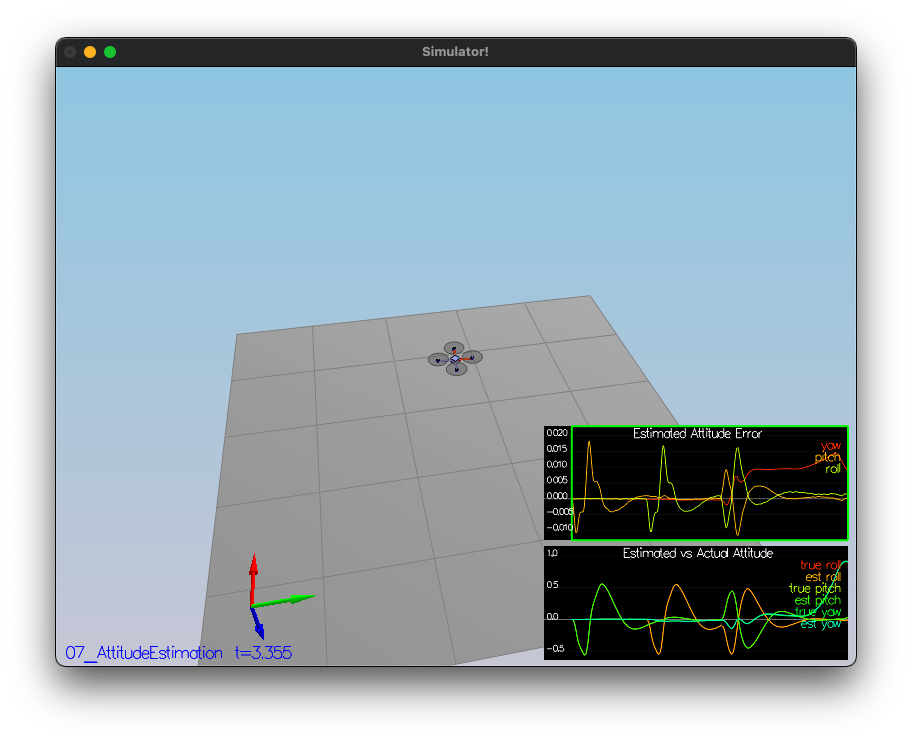
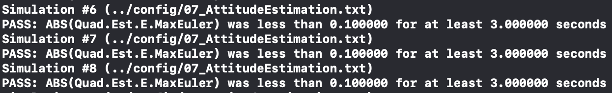
</p>

<p>&nbsp;</p>

### 3. Prediction Step ###

The next step is to implement the `PredictState()` function in `QuadEstimatorEKF.cpp` based on the following formulation: 

<p align="center">
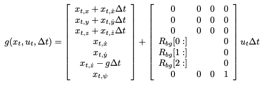
</p>

where the rotation matrix is given by

<p align="center">
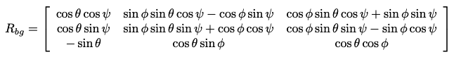
</p>

The results of implementing this prediction step <i>with a perfect IMU</i> are seen by the estimator state track the actual state, with only reasonably slow drift, as shown in the figure below:

<p align="center">
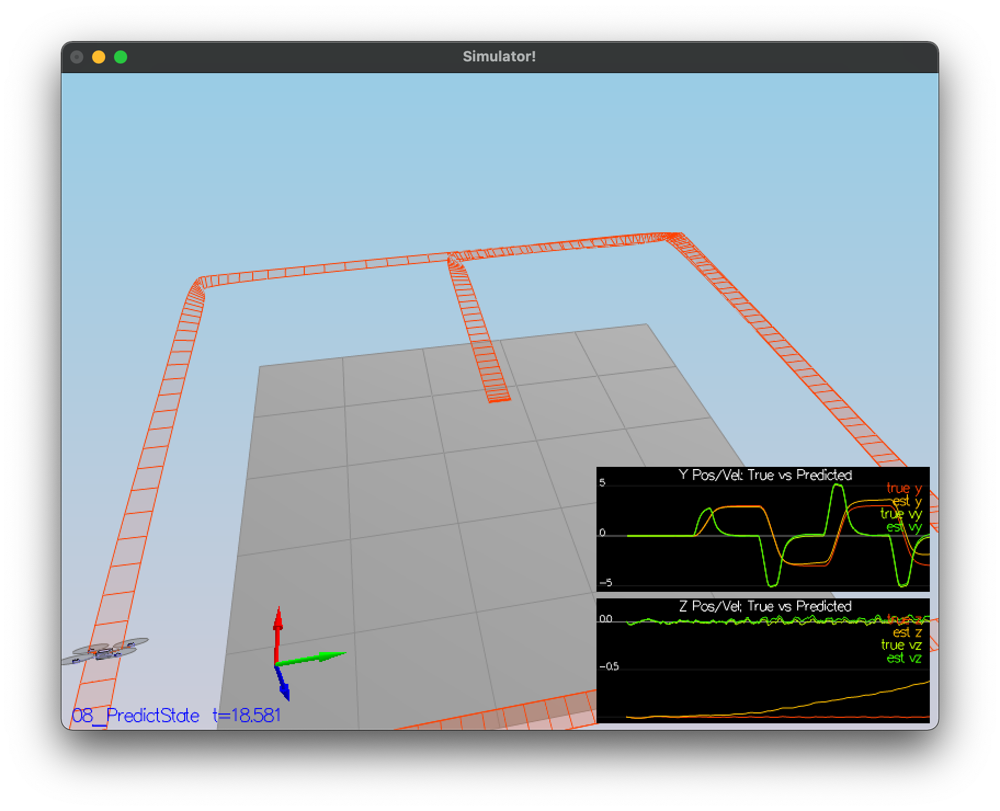
</p>

To implement a more realistic IMU (one with noise), a full implementation of the predict step was implemented by calculating the partial derivative of the body-to-global rotation matrix in the function `GetRbgPrime()` in order to predict the state covariance forward. This is done by the following Jacobian:

<p align="center">
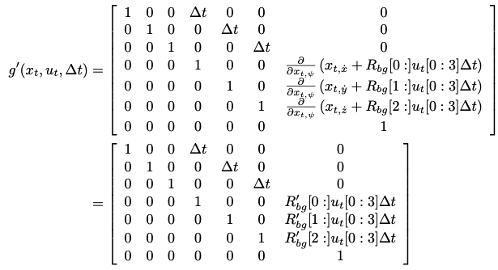
</p>

where the rotation matrix is

<p align="center">
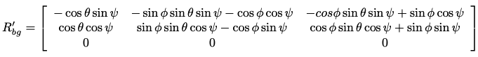
</p>

In addition, some parameter tuning was accomplished to best capture the `QPosXYStd` and the `QVelXYStd` process parameters in `QuadEstimatorEKF.txt`. The values used were
```bash
QPosXYStd = .05
QVelXYStd = .15
```

The results of implementing these changes to the predict step are shown below in a small fleet of quadcopters all using the prediction code to integrate forward.

<p align="center">
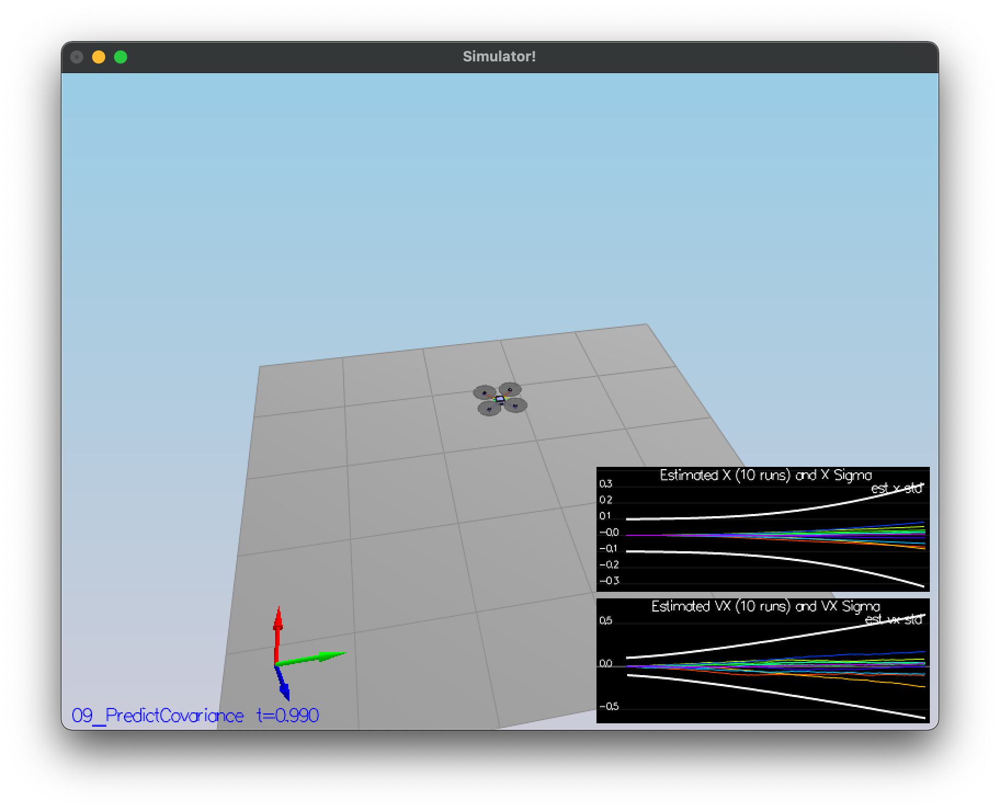
</p>

<p>&nbsp;</p>

### 4. Magnetometer Update ###

So far, only the accelerometer and gyro have been used for state estimation. The next step is to add the information from the magnetometer to improve the filter's performance in estimating the vehicle's heading.

Without using the magnetometer, the following plot shows the drift in yaw, primarily through the increasing estimated standard deviation.

<p align="center">
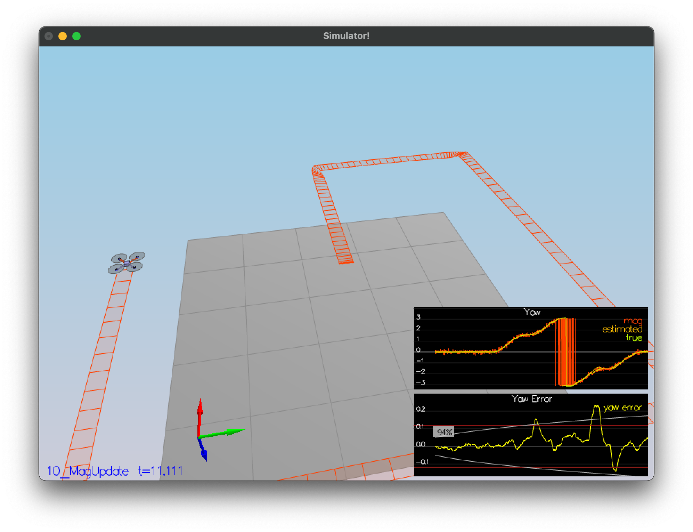
</p>

The magnetometer update is implemented in the function `UpdateFromMag()` and is based on using the magnetometer reporting yaw in the global frame.

<p align="center">
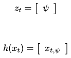
</p>

<p align="center">
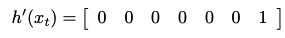
</p>

The following shows an estimated standard deviation that accurately captures the error and maintain an error of less than 0.1 rad in heading for at least 10 seconds.

<p align="center">
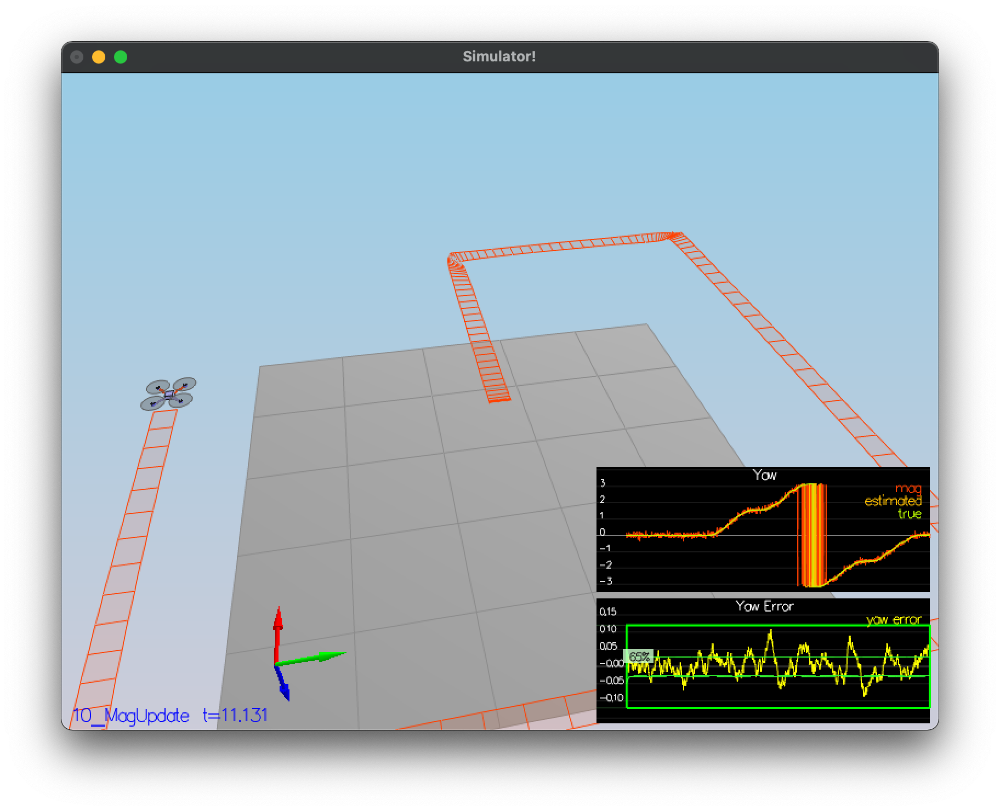
</p>

<p>&nbsp;</p>

### 5. GPS Update ###

The EKF GPS Update is implemented in the function `UpdateFromGPS()`. The update is accomplished as shown below:

<p align="center">

</p>

<p align="center">

</p>

<p align="center">

</p>

The results are shown below. The simulation completed with an estimated position error of < 1 m.

<p align="center">
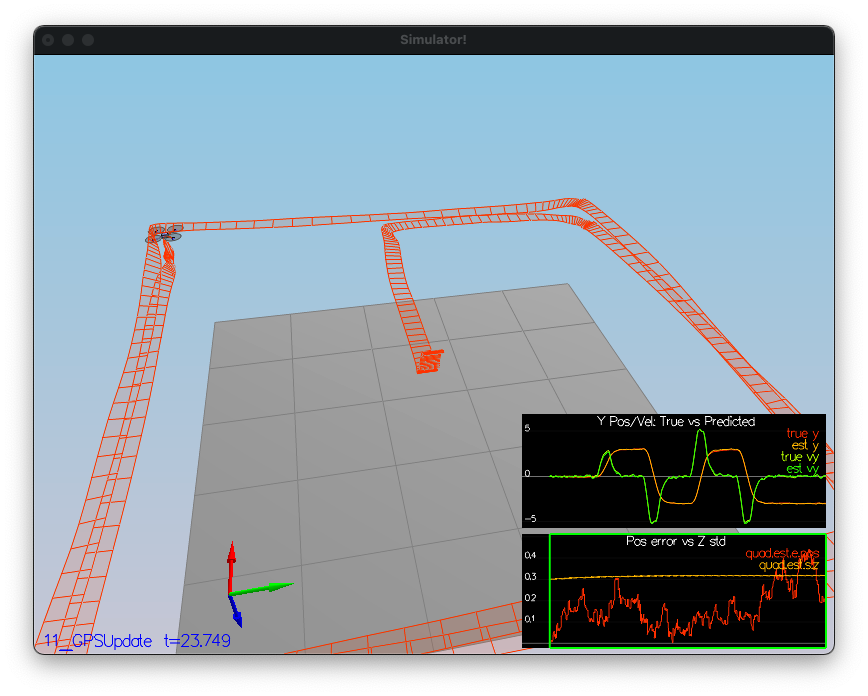

</p>

<p>&nbsp;</p>

### 6. Closed Loop Vehicle Control ###

The details of the custom controller are given in the repository https://github.com/stevenjnovotny/Quad-Controller

Running the original controller with the EKF produced the following erratic results.

<p align="center">
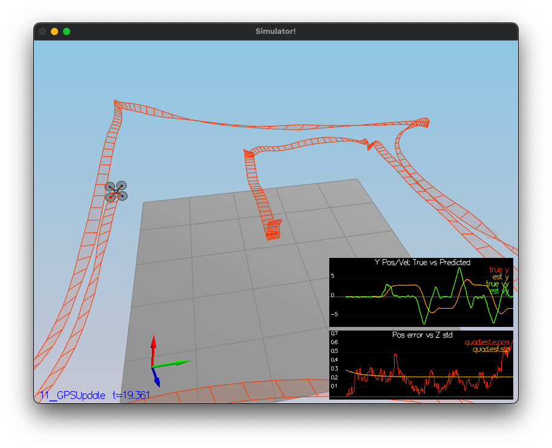
</p>

Since flying from an estimated state (even with ideal sensors) is very different from flying with ideal pose. Therefore, re-tuning of the controller was necessary. This was done by decreasing the position and velocity gains (by about 30%) to stabilize the vehicle. Even with minimal tuning the vehicle was able to complete the entire simulation cycle with an estimated position error of < 1m. The results are shown below.

<p align="center">
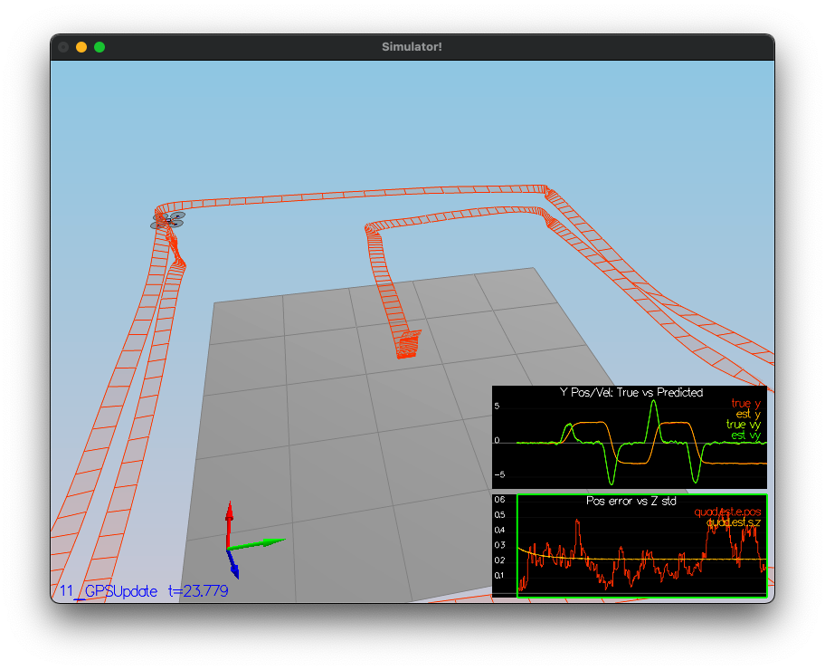
</p>

<p>&nbsp;</p>
 
## Conclusions ##

The EKF worked adequately with the custom controller, however additional tuning would have improved the performance even further. In fact, an important lesson in this project (which was also the case with the controller design) is that parameter tuning by observing vehicle performance and behavior is critical.

### Suggestions for further exploration ###

This process still requires formulation and implementation of fairly complex Jacobians. It would be interesting and instructive to see the results of implementing an Unscented Kalman Filter (UKF) in the same simulation.

<p>&nbsp;</p>

## References ##

Tellex, Brown, and Lupashin; "Estimation for Quadrotors", 2021 